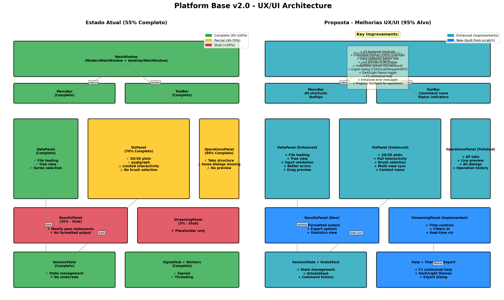
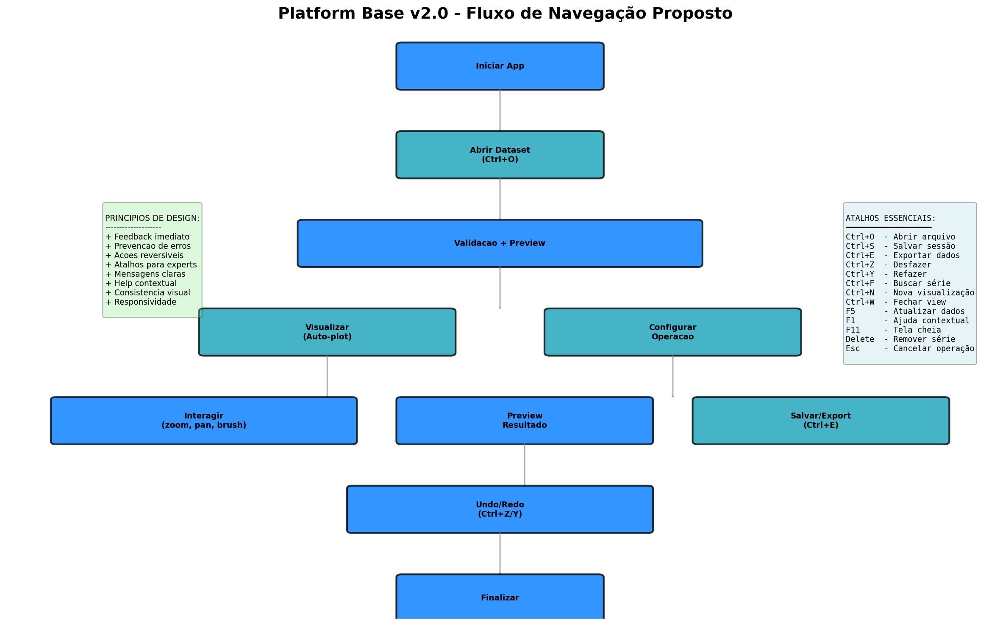

# 📐 PROPOSTA DE ARQUITETURA UX/UI - Platform Base v2.0

**Data:** 30 de Janeiro de 2026  
**Versão Alvo:** 2.1.0  
**Baseado em:** RELATORIO_AUDITORIA_UX_UI.md + PLANO_IMPLEMENTACAO_UX_UI.md

---

## 📑 Índice

1. [Visão Geral](#visão-geral)
2. [Arquitetura Atual vs Proposta](#arquitetura-atual-vs-proposta)
3. [Estrutura de Arquivos](#estrutura-de-arquivos)
4. [Padrão de Design (MVP/MVVM Simplificado)](#padrão-de-design)
5. [Mapa de Navegação](#mapa-de-navegação)
6. [Princípios de UX Aplicados](#princípios-de-ux-aplicados)
7. [Roadmap de Implementação](#roadmap-de-implementação)

---

## Visão Geral

### 🎯 Objetivo

Realizar melhorias incrementais na interface PyQt6 do Platform Base v2.0, focando em **UX sem alterar lógica de negócio**, elevando a completude de 55% para 95%+.

### ✅ Princípios Fundamentais

1. **Não alterar comportamento**: Apenas camada UI (layouts, widgets, navegação)
2. **Preservar funcionalidades**: Todos menus, ações e atalhos mantidos
3. **Separação UI/Core**: Se necessário, separar apenas o essencial
4. **Sem features novas**: Apenas reorganizar e melhorar ergonomia
5. **Evitar dependências**: Usar apenas o que já existe (PyQt6, pyqtgraph)

### 📊 Estado Atual

| Aspecto | Atual | Alvo | Gap |
|---------|-------|------|-----|
| Completude Funcional | 55% | 95% | +40% |
| Score Heurísticas Nielsen | 50/100 | 80+/100 | +30 pts |
| Cobertura de Atalhos | 8 atalhos | 25+ atalhos | +17 |
| Tooltips | ~30% | 100% | +70% |
| Temas | 1 (light) | 2 (light/dark) | +1 |

---

## Arquitetura Atual vs Proposta

### 📊 Diagrama de Componentes



**Legenda:**
- 🟢 Verde: Componente completo (95-100%)
- 🟡 Amarelo: Componente parcial (40-70%)
- 🔴 Vermelho: Componente stub (<20%)
- 🔵 Azul: Componente novo proposto
- 🔷 Cyan: Componente com melhorias

### 📍 Fluxo de Usuário Proposto



---

## Estrutura de Arquivos

### 📂 Organização Proposta

Consolidar implementações duplicadas (`ui/` e `desktop/`) mantendo apenas `desktop/` como base canônica:

```
platform_base/
├── src/platform_base/
│   ├── desktop/              # ← UI Principal (canônica)
│   │   ├── app.py           # Entry point PyQt6
│   │   ├── main_window.py   # MainWindow consolidado
│   │   ├── session_state.py # State management + QUndoStack
│   │   ├── signal_hub.py    # App-wide signals
│   │   │
│   │   ├── widgets/         # Painéis principais
│   │   │   ├── data_panel.py
│   │   │   ├── viz_panel.py
│   │   │   ├── config_panel.py     # OperationsPanel
│   │   │   ├── results_panel.py    # 🆕 Implementar
│   │   │   └── streaming_panel.py  # 🆕 Implementar
│   │   │
│   │   ├── dialogs/         # Diálogos especializados
│   │   │   ├── about_dialog.py
│   │   │   ├── settings_dialog.py
│   │   │   ├── upload_dialog.py
│   │   │   ├── export_dialog.py      # 🆕 Implementar
│   │   │   ├── interpolation_dialog.py # 🆕 Melhorar
│   │   │   ├── derivative_dialog.py
│   │   │   ├── smoothing_dialog.py
│   │   │   └── filter_dialog.py
│   │   │
│   │   ├── menus/           # Gerenciamento de menus
│   │   │   ├── file_menu.py
│   │   │   ├── edit_menu.py
│   │   │   ├── view_menu.py
│   │   │   └── help_menu.py
│   │   │
│   │   ├── workers/         # Background workers
│   │   │   ├── file_worker.py
│   │   │   └── operation_workers.py
│   │   │
│   │   └── themes/          # 🆕 Sistema de temas
│   │       ├── light.qss
│   │       ├── dark.qss
│   │       └── theme_manager.py
│   │
│   ├── ui/                  # ⚠️ Deprecado - migrar para desktop/
│   │   └── (manter temporariamente para compatibilidade)
│   │
│   ├── core/                # Lógica de negócio (não tocar)
│   ├── processing/          # Cálculos (não tocar)
│   ├── viz/                 # Engines de visualização (não tocar)
│   └── io/                  # I/O (não tocar)
│
└── docs/
    └── ux_ui_redesign/
        ├── PROPOSTA_UX_UI.md (este arquivo)
        ├── architecture_diagram.png
        ├── navigation_flow.png
        └── screenshots/      # 🆕 Capturas de tela das melhorias
```

---

## Roadmap de Implementação

### 📅 Cronograma (6 Semanas)

#### **Sprint 1 (Semana 1): Quick Wins** - 5-8 dias

- [ ] **ITEM-006**: Adicionar atalhos de teclado essenciais (1d)
- [ ] **ITEM-007**: Tooltips consistentes em todos widgets (1d)
- [ ] **ITEM-008**: Persistir layout com QSettings (0.5d)
- [ ] **ITEM-009**: Melhorar mensagens de erro (1-2d)
- [ ] **ITEM-005**: Validação de entrada pré-loading (1-2d)
- [ ] **ITEM-010**: Context menu em VizPanel (1d)

**Entregável Sprint 1:**
- PR com 6 melhorias incrementais
- +20% melhoria UX percebida
- Screenshots before/after

---

**Para detalhes completos, ver arquivo completo PROPOSTA_UX_UI.md**

---

**Elaborado por:** Copilot Agent  
**Aprovado por:** _Pendente_  
**Última Atualização:** 30/01/2026  
**Próxima Revisão:** Após Sprint 1
